# Monitoring and Observability with Selenium Workshop


## (1) Workshop Intro 🧠

### (1.1) Introduction 👋
A [Prometheus](https://prometheus.io/) exporter that collects [Selenium Grid](http://www.seleniumhq.org/projects/grid/) metrics is the first part of the workshop. The second part will focus on creating and visualizing testing metrics for your E2E UI functional tests. 

Observability is a must have nowadays that modern web applications are more complex than ever. But what exactly we mean to have observability in our testing infrastructure?

Grafana is a multi-platform open source analytics and interactive visualization web application. It can produce charts, graphs, and alerts for the web when connected to supported data sources. Participants will use docker compose to install locally a demo environment.

**Objectives:**

* Prometheus fundamentals and basics
* Pushgateway for collecting metrics
* AlertManager to alert engineering teams upon downtimes
* Selenium Grid Exporter & Grafana
* Visualizing testing metrics for your E2E UI functional testing suites

### (1.2) Prerequisites 🗒️

We need requirements to follow the hands-on lab today

* [Docker Engine](https://docs.docker.com/engine/install/)
* [VS Code](https://code.visualstudio.com/download)
* [Slack](https://slack.com/intl/en-gb/downloads/)
* [Java](https://www.oracle.com/java/technologies/downloads/)

### (1.3) Playground ⚽

First of all, clone the repository:
```
git clone git@github.com:Athens-SDET-Meetup/selenium_observability_workshop.git
```
Then, run the playground with:
```
cd selenium_observability_workshop; docker compose up -d
```
To verify everything is working, see in Docker Desktop that all instances are up and running like the below image:
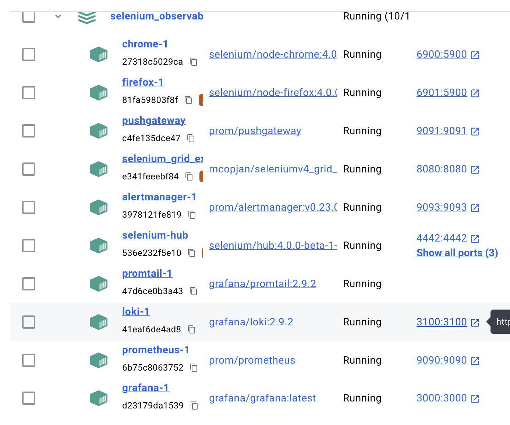

* Access Selenium Grid by visiting http://localhost:4444 and you will be able to see

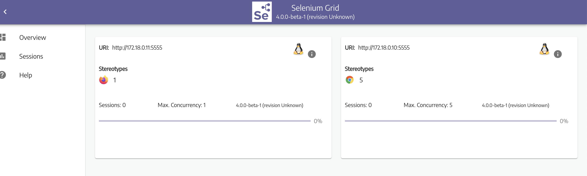

* Access Pushgateway by visiting http://localhost:9091 and you will be able to see

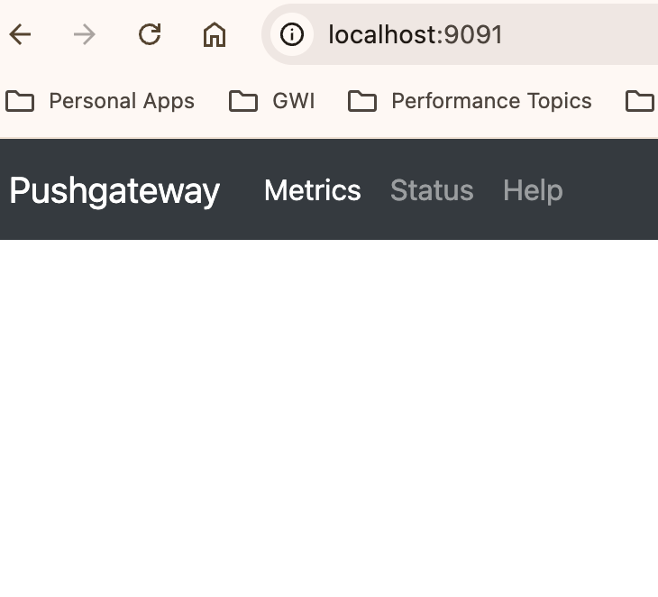

* Access Prometheus by visiting http://localhost:9090 and you will be able to see

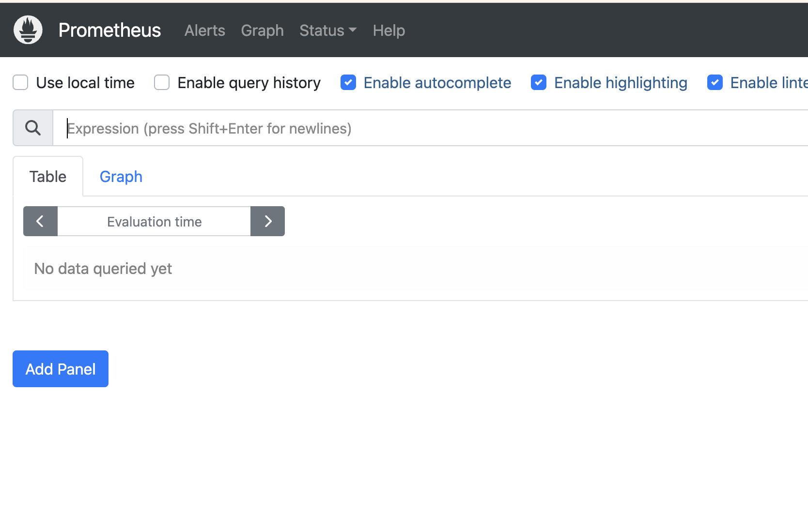

* Access AlertManager by visiting http://localhost:9093 and you will be able to see

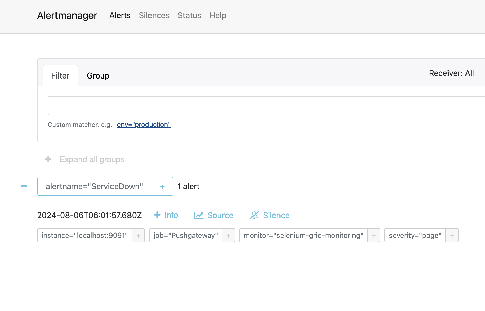

* Access Grafana by visiting http://localhost:3000 and you will be able to see

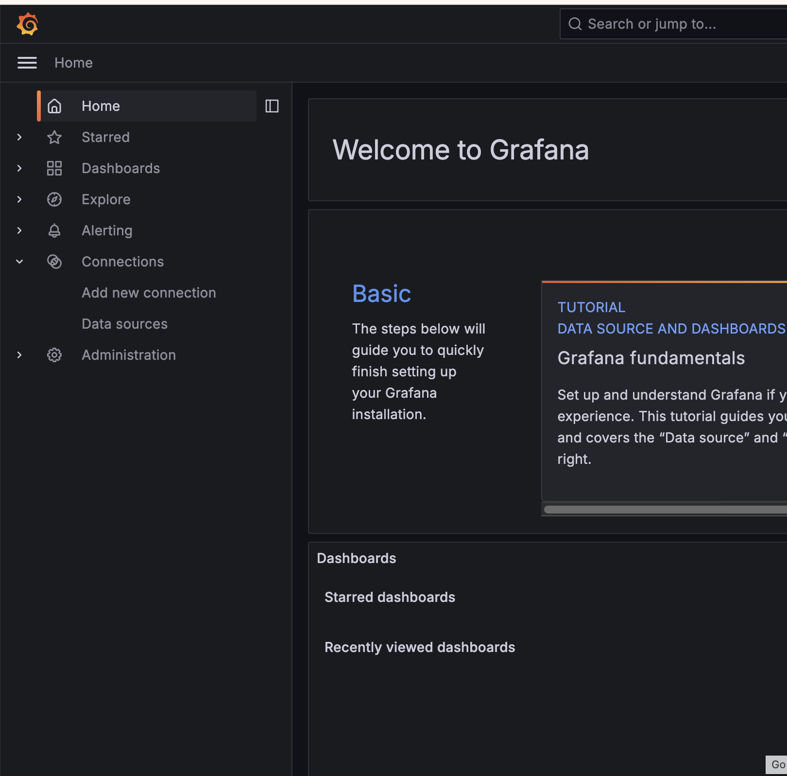

## (2) Foundations 🏛️

### (2.1) Prometheus & Pushgateway 📊

In this first section let us review how you can actually push metrics and scrap metrics from Pushgateway. 

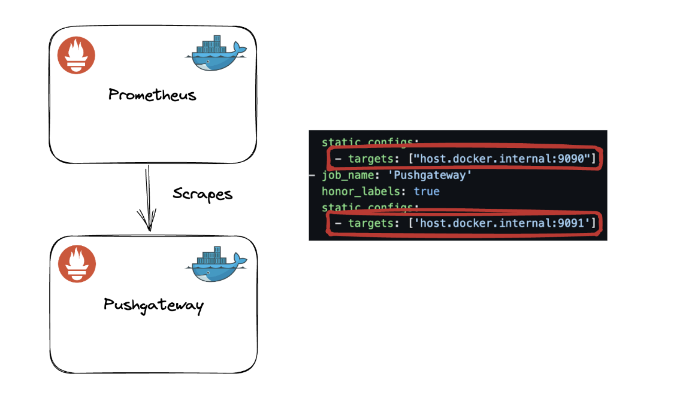

First we need to define the target in prometheus.yml file like host.docker.internal instead of localhost to be able to access it as its running within a docker container.

```javascript
  - job_name: 'Pushgateway'
    honor_labels: true
    static_configs:
      - targets: ['host.docker.internal:9091']
```

Now in order to start scrapping data let's push some in pushgateway!

Execute the following curl command:

Push a single sample into the group identified by {job="selenium"}:

```javascript
  echo "total_tests 15" | curl --data-binary @- http://localhost:9091/metrics/job/selenium
```

Now open prometheus and query to fetch the data:

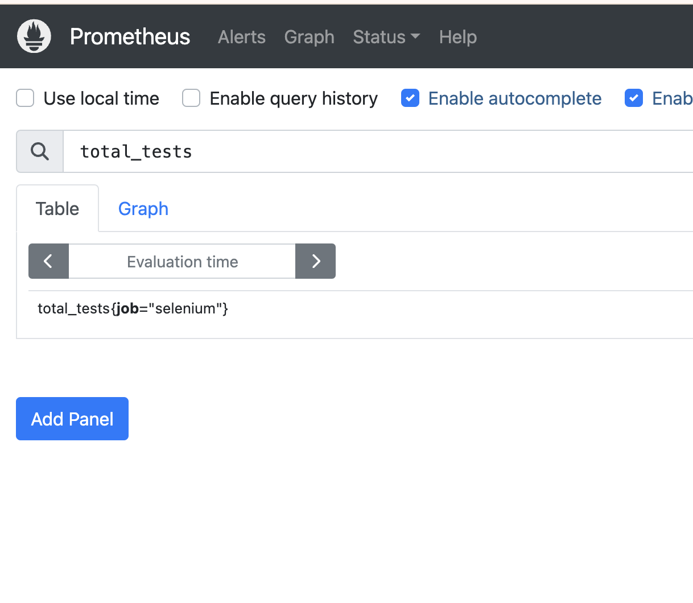

The scraping config is working as expected 🥳🥳🥳!!! 

Let's add some visualizations around these metrics in our Grafana instance. 
For that we need to execute PromQL.


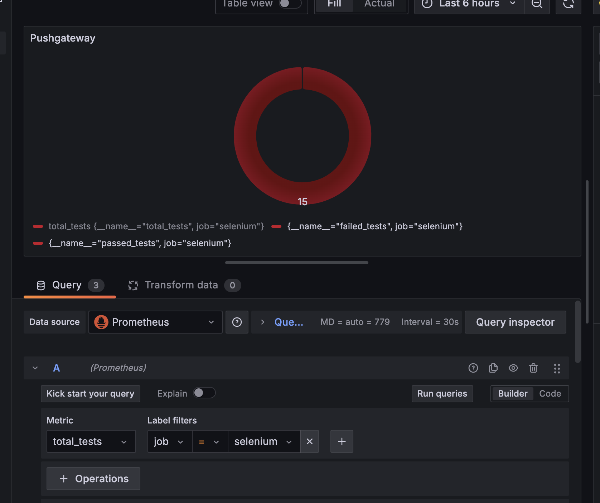

### (2.2) Selenium Grid Exporter ⚛️

In this section we will deep dive into the implementation of the Selenium Grid Exporter to see what sort of metrics we can extract from Selenium Grid. 

The architecture is the following:

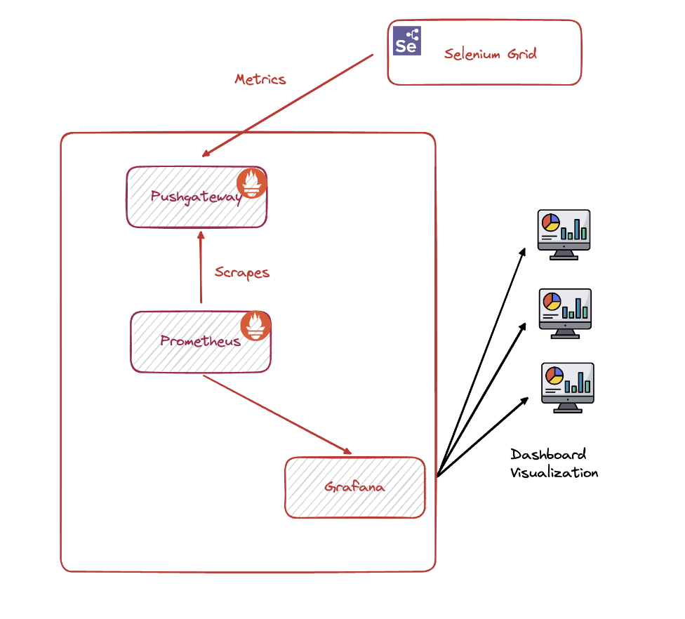

The metrics exposed from Selenium Grid Exporter:

```javascript
# HELP selenium_grid_hub_sessionCount number of active sessions
# TYPE selenium_grid_hub_sessionCount gauge
selenium_grid_hub_sessionCount 0
# HELP selenium_grid_hub_maxSession number of max sessions
# TYPE sselenium_grid_hub_maxSession gauge
selenium_grid_hub_maxSession 0
# HELP selenium_grid_hub_totalSlots total number of slots
# TYPE selenium_grid_hub_totalSlots gauge
selenium_grid_hub_totalSlots 8
# HELP selenium_grid_hub_sessionQueueSize number of session in queue
# TYPE selenium_grid_hub_sessionQueueSize gauge
selenium_grid_hub_sessionQueueSize 0
# HELP selenium_grid_up was the last scrape of Selenium Grid successful.
# TYPE selenium_grid_up gauge
selenium_grid_up 1
```
You can of course query them in Prometheus directly:

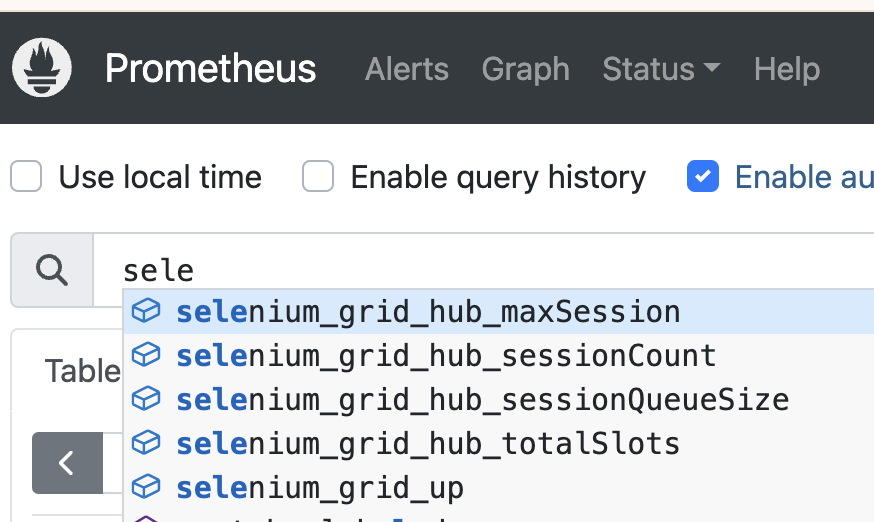

### (2.3) Alerting ⚠️

Now that exporter is up and running we will see how to alert teams for any downtimes. The Alertmanager handles alerts sent by client applications such as the Prometheus server. It takes care of deduplicating, grouping, and routing them to the correct receiver integration such as email, PagerDuty, or OpsGenie. It also takes care of silencing and inhibition of alerts.

We will be using Slack for our workshop so we need to create first a Slack Incoming WebHook as Incoming webhooks are a way to post messages from apps into Slack. Creating an incoming webhook gives you a unique URL to which you send a JSON payload with the message text and some options. You can use all the usual formatting and layout blocks with incoming webhooks to make the messages stand out.

Follow instructions from [Slack WebHooks](https://api.slack.com/messaging/webhooks) on how to set up and extract the token.

Next we need to add the token in the alertmanager.yml as well as define the channel you created to spawn alerts!

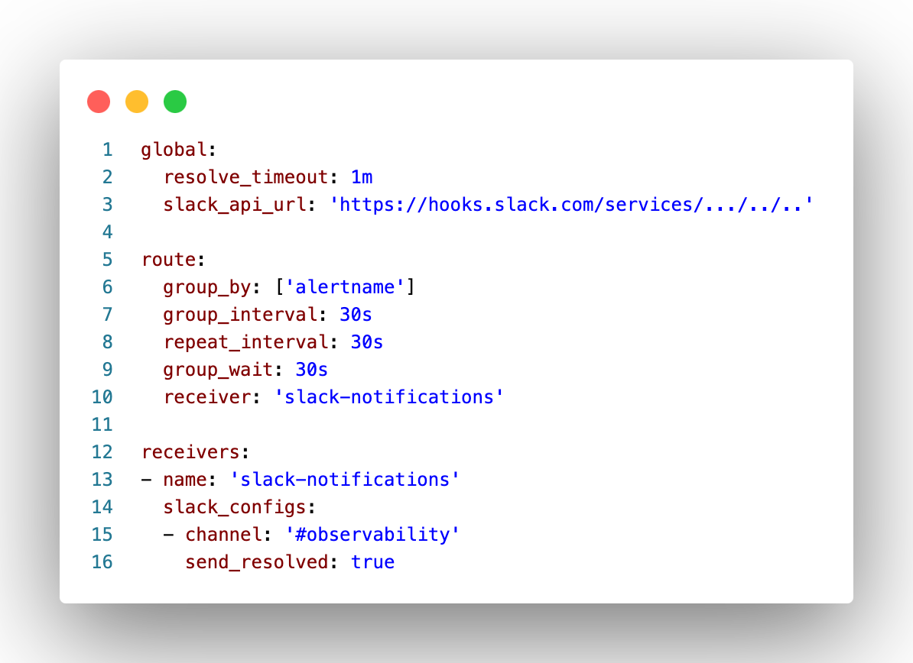

Now to test our integration let's bring down Selenium Grid! We hope a new Slack Alert will be generated within 30 seconds!

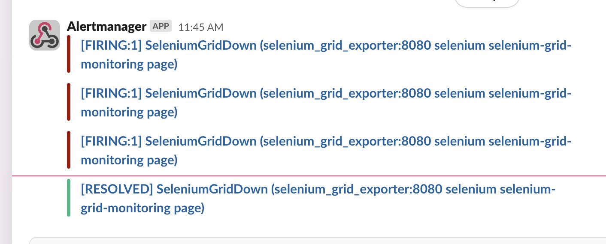

### (2.4) Dashboards 📈

### (2.5) Think Time 🤔💭


## (3) Selenium Testing 🧪

### (3.1) TestNG & Prometheus 🔎

### (3.2) Webdriver & Loki 📁

### (3.3) Visualizing E2E testing suites 🎯


